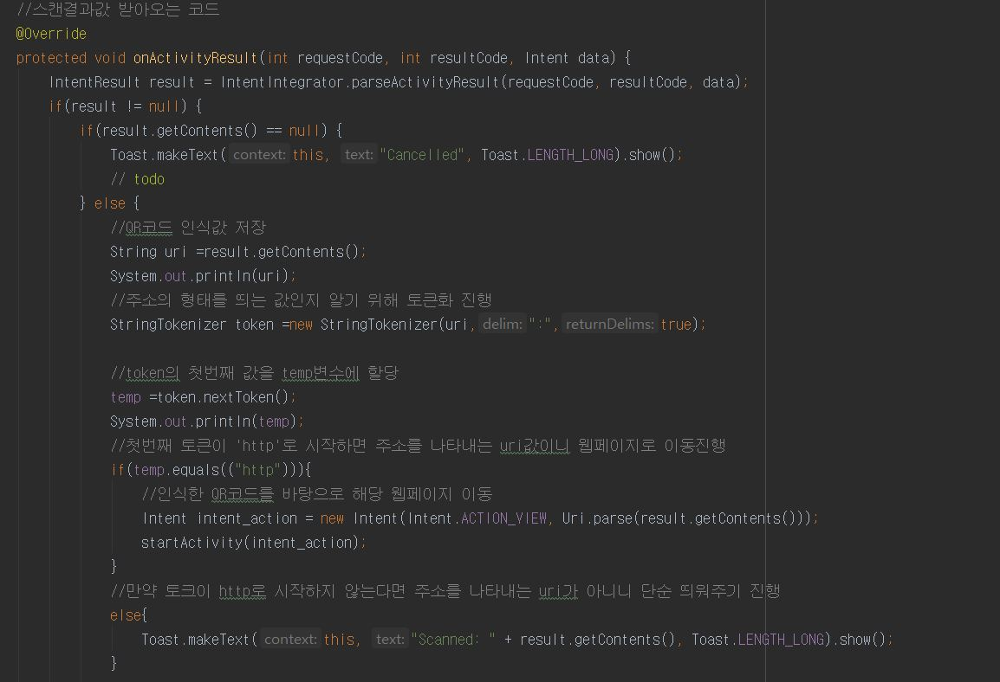

# Android-yolov3-QRcode
This Program Using YOLOV3 for object detection and using zxing Read QRcode 
# zxing을 이용하여 qr코드 스캔
- 액티비티를 바꿔서 qr코드 스캔을 진행한다

1. 빈 액티비티 생성

- app -> new -> activity -> empty activity

2. QR 클래스 불러오기

- Gradle -> build.gradle -> Module:app --> dependencies에 아래 코드 첨부

- implementation('com.journeyapps:zxing-android-embedded:3.6.0') { transitive = false }

- implementation 'com.google.zxing:core:3.3.0'

- 23번줄 implementation 'com.android.support:appcompat-v7:28.0.0' 에 Error: Program type already present:android.support.v4.app.ActivityCompat $OnRequestPermissionsResultCallback 에러가 난다면

implementation 'com.android.support:support-v4:28.0.0' 를 추가한 후 동기화

3. HardwareAccelerate 변경

- android:hardwareAccelerated="true" 입력하여 준다.

4. 액티비티 전환위환 버튼 생성 및 코드 작성  

5. QR코드 스캔 액티비티 구현  
  
  
  
6. 스캔한 결과 구별을 위한 코드 구현  

7. 결과화면
  
QR코드 생성기를 이용한 www.naver.com의 QR코드  
  
QR코드 인식  
  
  

Todo
Qr코드로 현재 위치 파악 후 지도를 불러온 다음 object detection을 이용하여 건물로 부터 정보 파악 및 위치 추적
  
  
참고: https://github.com/journeyapps/zxing-android-embedded  
참고: https://park-duck.tistory.com/108?category=843507
